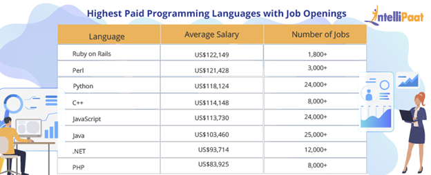
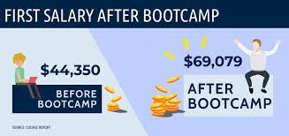
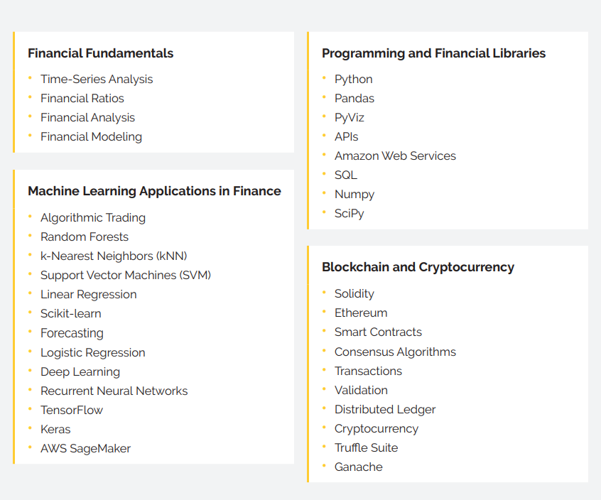
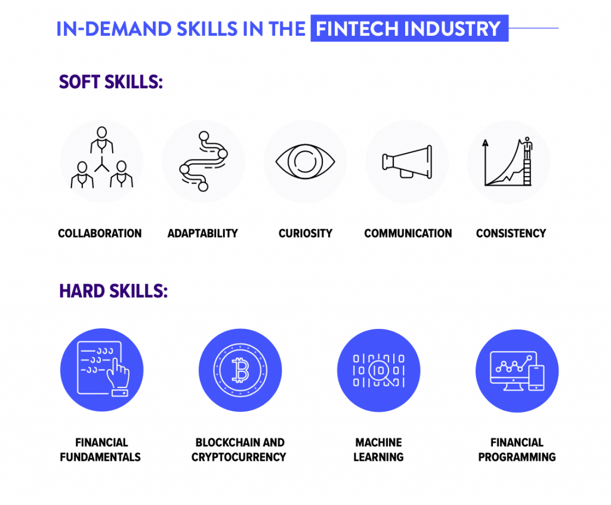
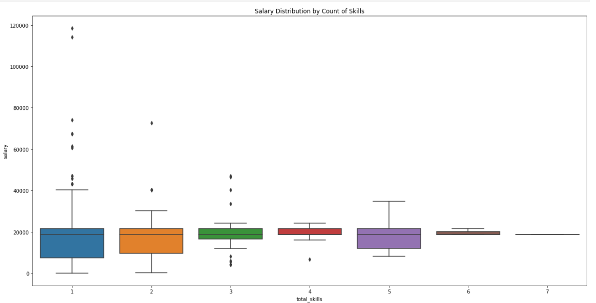
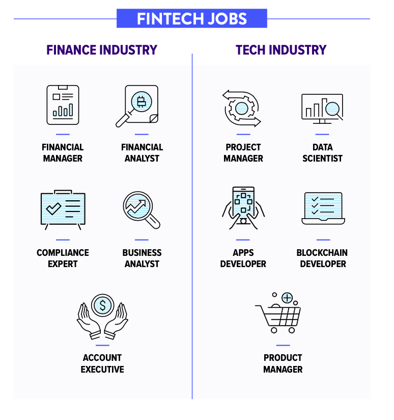

# **Predicting FinTech Bootcamp Graduate Salaries**

```
Project 2 - Group C
Presentation Date: January 15, 2022
Prepared by: Andrew Crawford, Margee Lancaster Rachel Pierce, Jinhyeong Park
```

#

## Project Title
Predicting FinTech Bootcamp Graduate Salaries  



#

## Project Team Members
- Andrew Crawford
- Margee Lancaster
- Rachel Pierce
- Jinhyeong Park

#

## Project Objective and Hypothesis  
  
Our objective was to research and learn what salaries are possible with skills obtained in this FinTech Bootcamp.  We used the Monster India API to retrieve data regarding job descriptions, skills, and salaries to determine the following:  
- What jobs require skills from this bootcamp?  
- What are the potential jobs and salaries for graduates with these skills?  
- Can we predict an accurate salary range based on these skills?  

Our hypothesis is that the more key skills you possess, the higher the salary.  
    


#

## Brief Background of Key Skills
As part of the U of MN FinTech Bootcamp, we have obtained the necessary skills to automate and improve financial services using cutting-edge technology.  Skills gained at the conclusion of Bootcamp include the following:   
  

  
We selected key skills from this course to use in our analysis.
#

## Datasets Used
We used data obtained from the Monster India API.
- https://crawlfeeds.com/datasets/monster-india-jobs-dataset    
  
We selected the following skills obtained during this FinTech Bootcamp to use in our model:
1. Database
2. Python
3. API
4. Algorithm
5. Cloud
6. Forecast
7. Big data
8. Dashboard
9. Project Management
10. Finance

We also used like-terms in our model to capture these skills using various terminology.  



#

##  Data Phases
Our process consisted of data exploration,  data preparation, and data cleanup. 
  
- *Data Exploration:* Google seaches, API searches, Monster India API, FinTech Bootcamp Curriculum  
- *Data Preparation:* Searching through variables in Spyder, selecting key data, narrowing down jobs, determining key skills
- *Data Cleanup:* Dropping unnecessary information, searching the data to find jobs that include at least one key skill
  
Data Issues: 
- Most salaries were in Indian rupees, not USD, so conversion was necessary.
- Some salaries may be skewed because there are some outliers from different countries/currencies in the data obtained from the API.
- There were likely job postings/salaries posted multiple times.
- The job posting "skills" section did not include the information we needed, so we had to rely on the job description to find job skills.
- Determining like-words for key skills was subjective, which may not capture all.
- As shown in the graph below, the most broad salary range includes at least one skill.



 # 

## Training/Testing and Predictive Model Evaluation

We ran a variety of machine learning algorithms to determine the best model to use:
1. Linear Regression
2. Extra Trees
3. Lasso
4. Random Forest
5. Ridge
6. Stochastic Gradient Descent   

#

## Model Performance

Techniques used to evaluate the model performance included running various machine learning algorithms to determine the best model.  Overall, we determined the Linear Regression model was the best fit for our project because it resulted in an R2 value closest to 1 and the lowest Mean Squared Error and Root Mean Squared Error scores the most times when re-running the model.  

 
 


#

## Summary of Conclusions/Predictions

Our model was not able to accurately predict salaries due to the limited data set.  Predicted salaries appear to be more of an average across the population.  Data implications, as discussed above, resulted in less reliable results, but could be improved with more data and a more relevant API.  
  


#

## Conclusion

  
Based on our analysis, we were not able to determine salary ranges for FinTech Bootcamp graduates.  However, the job salaries that included skills we have learned in this bootcamp were up to $80,000 (converted from Indian rupees, of course!)
  
*Difficulties/Implications:*  
 Overall, the API used was not the best and resulted in various data implications as discussed previously.  We could have spent $200 for access to the US Monster API, but we were cheap and perhaps will consider it for another future project based on the frustration of our data outcome!
  
*Potential Next Steps:*
Continue searching for an API with US-based jobs in USD, or pay the fee for the Monster US API.  
  
    


#

## Rough Breakdown of Tasks Completed
- Jupyter Notebook Creation
- Data Exploration, Preparation and Cleanup
- Running various machine learning models
- Training/testing and model evaluation
- Analysis and Conclusion
- Readme preparation
- html presentation

#

## Additional Notes
Please note that most salaries are in rupees and not U.S. dollars.  We converted the salaries to US dollars after data cleanup, but keep in mind these salaries are based in India and may be lower than those in the US.

#

## Workpapers in GitHub
Please refer to the following workpapers in GitHub:
- This **ReadMe** file (Includes a summary of the project)
- **Project2_Presentation.html** file (Class Presentation)
- **project2code.ipynb** file (Includes all code details)
- **starter_code.py** file (This is the Spyder file we used to dig into the data)
- **monster_india_latest_jobs_free_dataset.json** file (Includes dataset file)
- **Images** folder (Includes various images included in our project)
#

## References

- [Monster API Page](https://crawlfeeds.com/datasets/monster-india-jobs-datase)
- [FinTech Bootcamp Curriculum Overview](https://bootcamp.umn.edu/fintech/)
#
